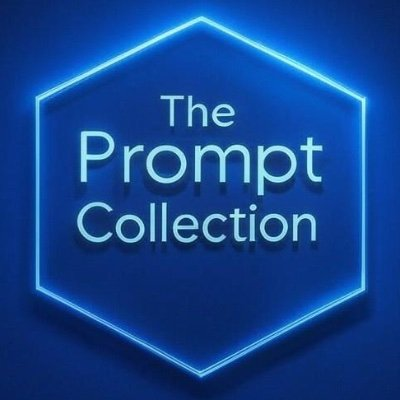

# The Prompt Collection

**The Prompt Collection** is a curated repository of diverse prompts designed for various purposes, such as writing, interviews, and more. Each category and subcategory includes a set of prompts along with corresponding system prompts to provide context and enhance relevance.

This project is hosted at [the-prompt-collection.github.io](https://the-prompt-collection.github.io), where users can browse, search, and interact with prompts in a user-friendly interface.

---

## Features
- **Organized Structure**: Prompts are categorized and tagged for easy navigation
- **System Prompts**: Pre-configured context setters for different use cases
- **Search Functionality**: Advanced search with filters and tags
- **Custom Tools**: Create and manage your own AI tools
- **Quick Start**: One-click conversation starters for popular AI platforms
- **Privacy**: Local-first approach with browser storage
- **Dark Mode**: Toggle between light and dark themes
- **Favorites**: Bookmark frequently used prompts
- **Analytics**: Track your prompt usage patterns
- **Offline Support**: Access prompts without internet connection
- **Quick AI Selection**: Dropdown-driven AI tool selector for streamlined conversations

---

## Usage
1. **Browse Prompts**:
   - Navigate through categories and subcategories to find prompts.
   - Use the search bar to filter prompts by keywords or tags.

2. **System Prompts**:
   - System prompts are prefixed with `system_` and provide context for generating responses.
   - Example: `system_fiction_author.md` defines a persona for a fictional author.
   - Quickly use system prompts with selected AI tools or user-defined custom tools.

3. **Modify and Copy**:
   - Open any prompt to view its content.
   - Modify the prompt directly on the website and copy the updated text using the "Copy" button.

4. **Custom Tools**:
   - Add, modify, or delete custom AI tools

---

## Contribution Guidelines
We welcome contributions to **The Prompt Collection**! Here’s how you can help:

1. **Add New Prompts**:
   - Create a new `.md` file in the appropriate category/subcategory folder.
   - Use the naming convention: `category_subcategory_prompt_name.md`.
   - Example: `writing_fiction_character_backstory.md`.

2. **Add System Prompts**:
   - Prefix system prompt filenames with `system_`.
   - Example: `system_writing_fiction_author.md`.

3. **Update README**:
   - If you add a new category or subcategory, update the `README.md` to reflect the changes.

4. **Submit a Pull Request**:
   - Fork the repository, make your changes, and submit a pull request with a clear description of your additions.

---

## Attribution
Many prompts in this collection have been copied and modified from the following sources:
- [TheBigPromptLibrary](https://github.com/0xeb/TheBigPromptLibrary)
- [~jamesponddotco/llm-prompts](https://sr.ht/~jamesponddotco/llm-prompts/)
- [r/ChatGPTPromptGenius](https://www.reddit.com/r/ChatGPTPromptGenius/)

We are grateful to the creators of these prompts for their inspiration and original work. If you believe any content has been improperly attributed or used, please contact us, and we will address the issue promptly.

---

## License
This project is licensed under the [MIT License](LICENSE). Feel free to use, modify, and distribute the prompts as needed.

---

## Contact
For questions, suggestions, or collaboration opportunities, please open an issue on the [GitHub repository](https://github.com/the-prompt-collection/prompt-collection) or contact us at [contact.taco.fr@gmail.com](mailto:contact.taco.fr@gmail.com).

---

Happy prompting! 🚀